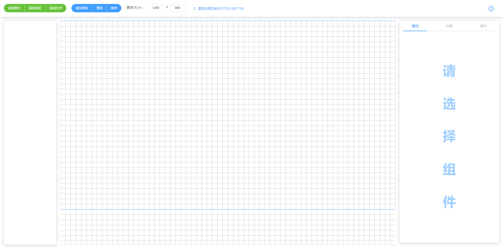

## **vue3-element-vite-template**

> 一款可视化编辑元素并生成html的vue操作组件

[github在线预览地址](https://maxfengyan.github.io/visual-draggable/index.html)

[gitee在线预览地址](https://maxfengyan.github.io/visual-draggable/index.html)

> 此项目参考 [visual-drag-demo](https://github.com/woai3c/visual-drag-demo)实现，做了较大改动，抛弃vuex依赖，改为纯vue组件状态开发，vue3+vite，组件即拿即用，移植方便可当作组件嵌入vue项目中

### 嵌入方式

1.复制src/visual-drag文件夹到新项目中

2.在vue中以component形式引入src/visual-drag/index.vue或者以router形式指向src/visual-drag/index.vue文件即可

**tips: 确保新项目引入element-plus**

### 项目截图

#### 完成功能：

|      左侧预览区      | 画布区域 | 顶部区域 | 右侧菜单区域 |
| :------------------: | :------: | :------: | :----------: |
| 组件拖拽调整层级顺序 |  图片组件         | 清空画布 | 图片上传修改 |
|  点击组件预览区高亮  |  文字组件         | 暗黑模式 | 属性值修改后所有组件自响应 |
|  显示组件排序号顺序  |  热区组件         | 预览 | 属性值边界值限制 |
| 锁定 |  拖拽放大缩小      |         |              |
| 删除 |  旋转组件         |          |              |
| 上移 |  网格             |          |              |
| 下移 |  1280x720区域     |          |              |
|                   |  上左右边界限制拖拽  |          |              |
| | 解锁/锁定(组件锁定状态无法进行任何操作) | | |
| | 右键复制/粘贴 | | |
| | 右键删除 | | |
| | 右键置顶/置底 | | |
| | 键盘事件-删除 | | |
| | 键盘事件-上下左右移动 | | |
| | 键盘事件-f5刷新页面给警告提示 |          | |

#### 未完成功能：
|      左侧预览区      | 画布区域 | 顶部区域 | 右侧菜单区域 |
| :------------------: | :------: | :------: | :----------: |
| 点击预览区域组件定位组件 |  画布自定义尺寸  | 操作步骤回退/前进 | 添加事件 |
|    |  组件吸附   | 组合 | 添加动画 |
|    |  标线显示     |  |  |
|                |  下边界自动延伸    |  |  |
|                |    |  |              |
|                   |    |  |              |
| |  |  | |
